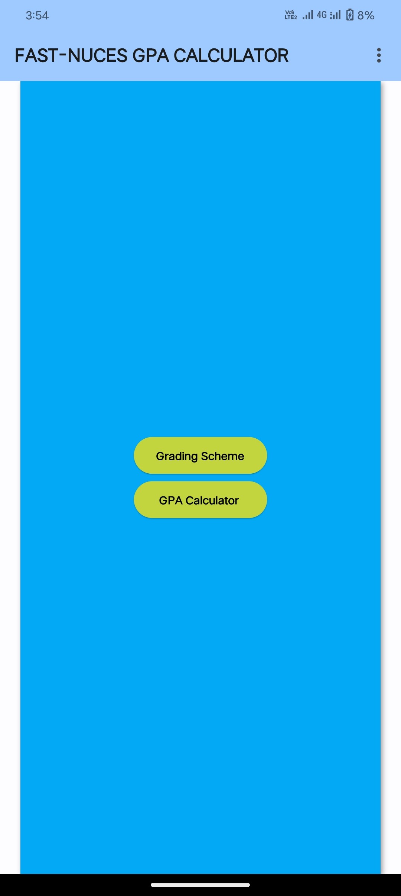
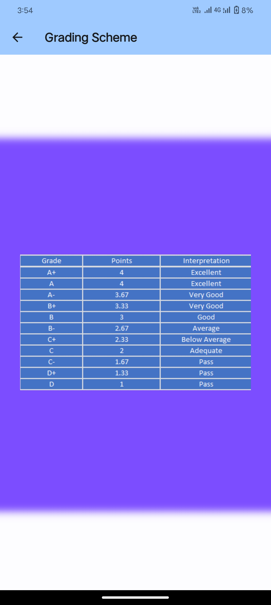
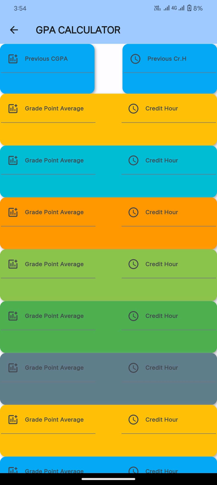
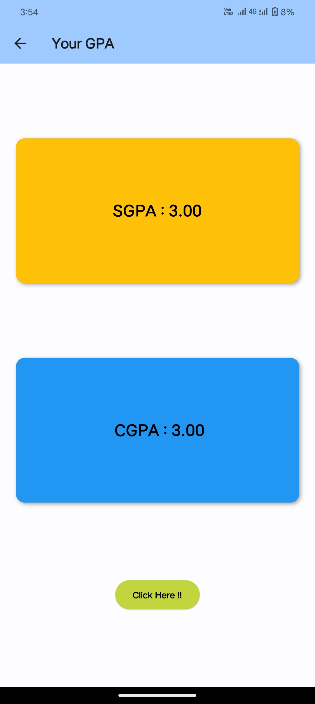
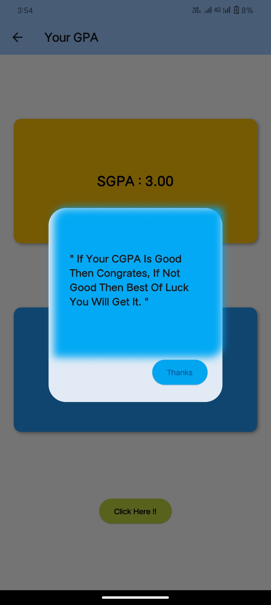

# Project Name - Flutter App

## Introduction

This repository contains a Flutter app project developed using the Dart programming language. The app aims to provide efficient GUI and accurate result.

## Table of Contents

- [Features](#features)
- [Screenshots](#screenshots)
- [Usage](#usage)
- [Contributors](#contributors)

## Features

- **Feature 1**: [There is 100% accurate result available for not only fastian but for all universities students also]
- **Feature 2**: [Fastians can see their grading scheme also there.]

## Screenshots

## Usage

1. **Run the App**: `flutter run`
2. [You can run app using Android Studio/VS Code.]

## Contributors

- [Talha Shahid](https://github.com/Talha-Shahid12)

